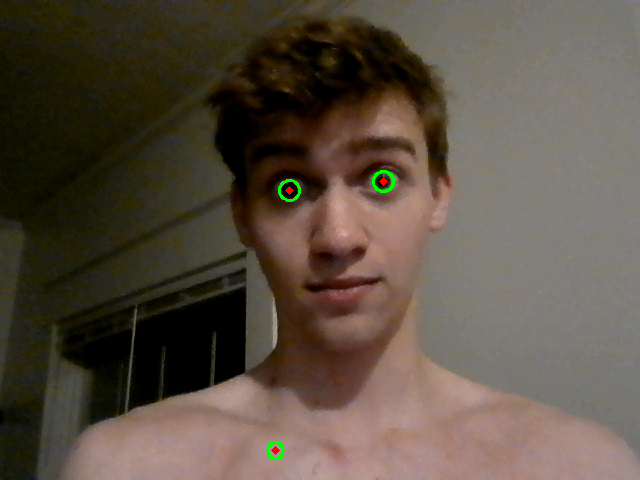
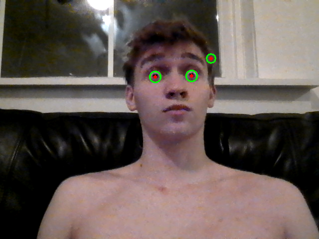
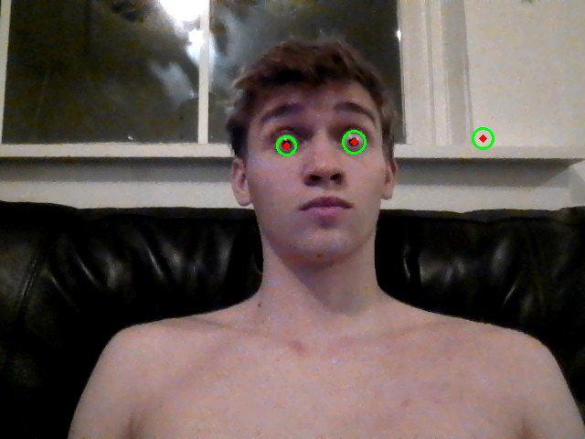
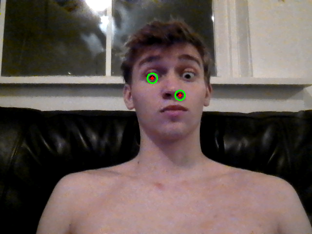
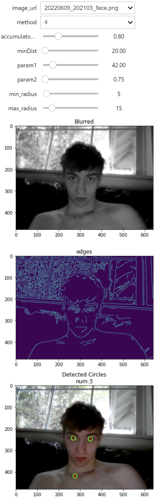

# detect-eyes

to detect eyes using opencv in a python notebook.
 
Using the webcam, the program will detect eyes and display them in a window.
The libraries used can be found at the top of the notebook

### Results

### fine tuning parameters for your own circles

 
## License
[MIT](https://choosealicense.com/licenses/mit/)
 
